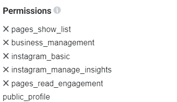

# InstagramPostsAnalyzer

# Overview
This project focuses on obtaining and streaming posts from Instagram using Meta's Graph API, pre-processing their captions and feeding them into a classifier model to detect if the post itself is fake news or not.
# Structure
1. Request&Stream
2. Processing
3. Model-PassiveAggressive
    * Train and test data on Instagram posts
    * Train on Kaggle fake news data set, test on instagram posts
    * Train on instagram posts data set, test on Kaggle fake news
4. Fact checker

The notebooks in the optional folder represent expansions to this project and possible future work topics.

# How-to

For requesting the posts of a hashtag, which are required for the project, the following are required:

* Facebook developer account

* A business Page

* Instagram Business account

A custom App created through the Facebook development interface, which is linked to the three aforementioned bulletpoints

The following code is used for streaming the posts of a hashtag on instagram. To be able to run this code, the access token needs to be prepared by adding the following permissions:

 Afterwards, after linking the page to the app and the instagram business account to the page, the user can obtain the linked instagram accounts of the page by running the following request with the page API token:

``https://graph.facebook.com/v17.0/me?fields=connected_instagram_account``

The next step, while using the same API, is querying for the required hashtag id. Example:

``graph.facebook.com/ig_hashtag_search?user_id="obtained from the last request"&q="name of the hashtag"``

After obtaining the hashtag ID, the recent posts are obtained with the following request:

``graph.facebook.com/""Hashtag ID obtained from last query"/recent_media?access_token=""ENTER_ACCESS_TOKEN"&fields=id,permalink,comments_count,like_count,media_type,media_url,timestamp,caption&user_id="ENTER_INSTAGRAM_ID&limit=50'``

Such queries are also possible for top media by replacing ``recent_media`` with ``top_media``

Afterwards, run the processing notebook on the saved data set containing the streamed posts and finally implement it in the PassiveAgressive classifier model.
# Results
The Passive-Aggressive Classifier proved to be the most viable model, so it has been applied on three different scenarios:
* Train and test sets based on the Instagram posts: ~85% accuracy
* Train set consisting of a fake news data set obtained from Kaggle with the same instagram posts as test set: ~45% accuracy
* Instagram posts as train set with the kaggle data set as a test set: ~60% accuracy

Various cases of correctly predicted fake news have also been confirmed by the fact checker.
